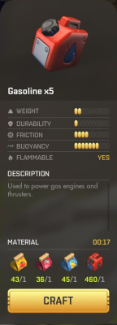

# Scripts

_To change stuff in [Scrap Mechanic](https://store.steampowered.com/app/387990/Scrap_Mechanic/)_

One day I might make a full blown mod out of these (once I figure out how to do this correctly. Right now I'm just collecting scripts so I can reapply them if and when the game scripts change.

**Content:**

- [General Notes](#general-notes)
- [Gasohol](#gasohol)
    - [Gasohol Tier 1](#gasohol-tier-1)
    - [Gasohol Tier 2](#gasohol-tier-2)
    - [Potato Gasohol](#potato-gasohol)

<hr/>

# General Notes

- the mapping between UUID and item name is in _Survival\CraftingRecipes\item_names.json_


# Gasohol

Based on [this mod](https://www.reddit.com/r/ScrapMechanic/comments/gj4b3g/mod_simple_quality_of_life_edit/) I added two more gasohol variants so all seeds are useful. (I'm clearly not at the point yet where I have last tier seeds.)

## Gasohol Tier 1



**Apply to:** _Survival/CraftingRecipes/craftbot.json_

**Changes:** Adds recipe to craft gasoline from tier 2 seeds.

**Script:**

```lua
	{	// Gasohol Tier 1
		"itemId": "d4d68946-aa03-4b8f-b1af-96b81ad4e305",
		"quantity": 5,
		"craftTime": 14,
		"ingredientList": [
			{	// Tomato Seed
				"quantity": 1,
				"itemId": "38e41fb5-dd50-4294-829d-a517f0282fed"
			},
			{	// Redbeet Seed
				"quantity": 1,
				"itemId": "64051718-a3f1-422b-bda3-277efa0c4545"
			},
			{	// Carrot Seed
				"quantity": 1,
				"itemId": "9c82a525-8a8b-4483-9595-505aaa042486"
			},
			{	// Gas
				"quantity": 1,
				"itemId": "d4d68946-aa03-4b8f-b1af-96b81ad4e305"
			}
		]
	},
```


## Gasohol Tier 2


**Apply to:** _Survival/CraftingRecipes/craftbot.json_

**Changes:** Adds recipe to craft gasoline from tier 2 seeds.

**Script:**

```lua
	{	// Gasohol Tier 2
		"itemId": "d4d68946-aa03-4b8f-b1af-96b81ad4e305",
		"quantity": 5,
		"craftTime": 14,
		"ingredientList": [
			{	// Banana Seed
				"quantity": 1,
				"itemId": "22beade5-38ca-47b4-a2ee-32403f58a862"
			},
			{	// Blueberry Seed
				"quantity": 1,
				"itemId": "4b6d2bee-d0f1-4e56-96f0-d2596388cad2"
			},
			{	// Orange Seed
				"quantity": 1,
				"itemId": "bee966b0-b5e5-41da-b992-5d363ab85ae4"
			},
			{	// Gas
				"quantity": 1,
				"itemId": "d4d68946-aa03-4b8f-b1af-96b81ad4e305"
			}
		]
	},
```


## Potato Gasohol


**Apply to:** _Survival/CraftingRecipes/craftbot.json_

**Changes:** Adds recipe to craft gasoline from potato seeds.

**Script:**

```lua
	{	// Potato Gasohol
		"itemId": "d4d68946-aa03-4b8f-b1af-96b81ad4e305",
		"quantity": 5,
		"craftTime": 14,
		"ingredientList": [
			{	// Potato Seed
				"quantity": 5,
				"itemId": "eb1ef696-5c05-4662-9e47-fe1e0875ff84"
			},
			{	// Gas
				"quantity": 1,
				"itemId": "d4d68946-aa03-4b8f-b1af-96b81ad4e305"
			}
		]
	},
```


# Stack Size Changes

Sometimes the stack size of items seems to be too small. This section shows you how to change it.

**Note:** Some of these the entry `"itemStack": {}` is missing, which allows for the items placed in the game world to stack. They are marked with an "!" in the tables if you want to change it.


## Consumables

For things you can use, the stack size can be changed in _Survival/Objects/Database/ShapeSets/consumable.json_. Items you might want to change are:

| UUID | Item | Item Stack |
| ---- | ---- | ---------- |
| `54d8ef21-357d-48a3-a66d-40446f6bb686` | Carrot burger |  |
| `f74c2891-79a9-45e0-982e-4896651c2e25` | Chemical |  |
| `5530e6a0-4748-4926-b134-50ca9ecb9dcf` | Component | ! |
| `ac0b5b0a-14e1-4b31-8944-0a351fbfcc67` | Fertilizer |  |
| `e243f642-6934-42bb-8cdd-f8ff1704d411` | Long sandwich |  |
| `2c4a2633-153a-4800-ba3d-2ac0d993b9c8` | Milk |  |
| `54d84731-d9ec-435d-bc9d-d48e0763b1bf` | Pizza burger |  |
| `9a3e478c-2224-44fa-887c-239965bd05ad` | Soil bag |  |
| `cb7305b2-d8b5-4302-aff3-6cdd9212ca64` | Sun shake |  |


## Resources

Objects that are only to craft other stuff can be found in _Survival/Objects/Database/ShapeSets/resources.json_. Items you might want to change are:

| UUID | Item | Item Stack |
| ---- | ---- | ---------- |
| `fcf0958c-084d-4854-9b1b-b06594b4262a` | Beewax | ! |
| `f152e4df-bc40-44fb-8d20-3b3ff70cdfe3` | Circuit board |  |
| `40e8bd0d-04a0-4e95-b593-4038b54b156f` | Clam | ! |
| `fe8bfeba-850b-4827-9785-10e2468c9c23` | Corn |  |
| `267e0c93-62e3-45ad-9470-a14035cb9ca4` | Ember |  |
| `388adeab-67e5-4901-afe8-c56217754510` | Glow Poop | ! |
| `36335664-6e61-4d44-9876-54f9660a8565` | Glue | ! |


| `fb0f128c-e607-4c52-9c25-f44dfd2dd95e` | Steak | ! |
|  |  |  |
